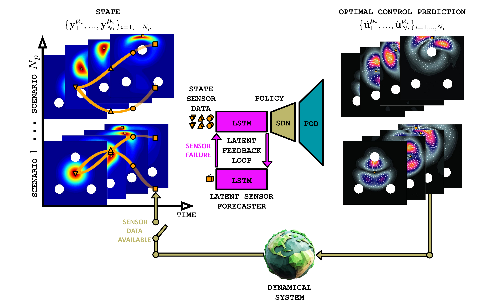
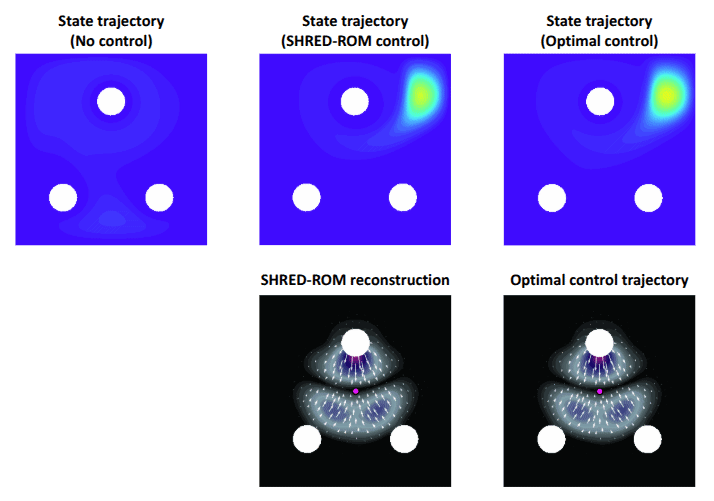
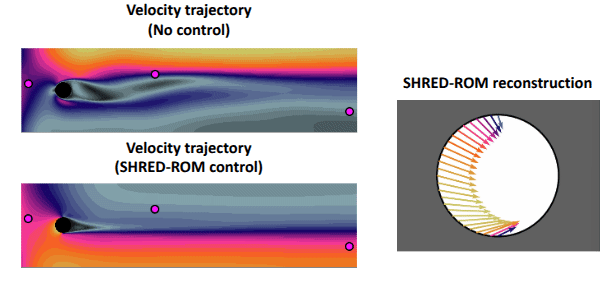
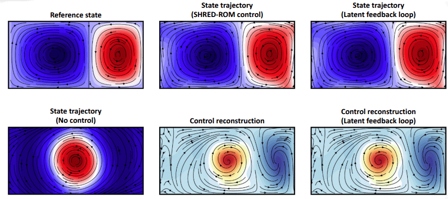

# Real-time optimal control with shallow recurrent decoder networks

[](https://arxiv.org/abs/2607.19302)
[](https://doi.org/10.5281/zenodo.20627878)

## Overview
<p align="center" width="100%">
  
  <br />
</p>

*SHallow REcurrent Decoder-based Reduced Order Model* (SHRED-ROM) is an ultra-hyperreduced order modeling framework aiming at reconstructing high-dimensional data from limited sensor measurements in multiple scenarios. In this work, we employ SHRED-ROM in the context of imitation learning to solve high-dimensional and parametric optimal control problems in real-time. Thanks to the composition of a Long-Short Term Memory network (LSTM) and a Shallow Decoder Network (SDN), SHRED-ROM is capable of
- Reconstructing high-dimensional optimal control actions from sparse state sensor measurements in new scenarios unseen during training, regardless of sensor placement,
- Dealing with both physical, geometrical and time-dependent parametric dependencies, while being agnostic to the parameter values,
- Estimating the corresponding high-dimensional controlled state dynamics,
- Coping with both fixed or mobile sensors.

Importantly, computational efficiency and memory usage are enhanced by reducing the dimensionality of full-order snapshots through Proper Orthogonal Decomposition (POD), allowing for compressive training of the networks, with minimal hyperparameter tuning and laptop-level computing.


## Quickstart

```python
import torch
import numpy as np
```

```python
# Data loading and train-validation-test splitting

from utils.datamanager import DataManager

datamanager = DataManager(np.load("data/file.npz"),
                          train_ratio = 0.8,
                          valid_ratio = 0.1,
                          test_ratio = 0.1)

datamanager.prepare()
```

```python
# Data compression

k = ... # Define the compressed dimension
datamanager.POD(ranks = {'control': k})
```

```python
# Padding and lagging

from utils.datamanager import Padding, TimeSeriesDataset

lag = ... # Define the lag parameter

train_data_in = Padding(sensors_data_train, lag).to(device)
valid_data_in = Padding(sensors_data_valid, lag).to(device)
test_data_in = Padding(sensors_data_test, lag).to(device)

train_data_out = Padding(datamanager.data_POD["control"][datamanager.train] ,1).squeeze(1)
valid_data_out = Padding(datamanager.data_POD["control"][datamanager.valid] ,1).squeeze(1)
test_data_out = Padding(datamanager.data_POD["control"][datamanager.test] ,1).squeeze(1)

train_dataset = TimeSeriesDataset(train_data_in, train_data_out)
valid_dataset = TimeSeriesDataset(valid_data_in, valid_data_out)
test_dataset = TimeSeriesDataset(test_data_in, test_data_out)
```

```python
# SHRED-ROM training

from utils.models import SHRED, fit

nlatent = 64
shred = SHRED(nsensors, k, hidden_size = nlatent, hidden_layers = 2, decoder_sizes = [350, 400], dropout = 0.1)
train_errors, valid_errors = fit(shred, train_dataset, valid_dataset, batch_size = 64, epochs = 500, lr = 1e-3, verbose = True, patience = 100)
```

```python
# SHRED-ROM evaluation

from utils.postprocessing import mre_numpy, num2p

shred.freeze()

shred_pred = shred(test_data_in)

data_test_pred = datamanager.decode(data_POD = {'control': shred_pred})

print(f"Mean relative SHRED-ROM reconstruction error: {num2p(mre_numpy(datamanager.data['control'][datamanager.test], data_test_pred['control']))}")
```

## Getting started
The required packages are listed in  the `requirements.txt` file and may be installed in few minutes through the command 
```bash
pip install -r requirements.txt
```
Some test cases required FEniCS and FEniCS-Adjoint to generate and handle function data. [Click here](https://fenicsproject.org/download/archive/) and [here](https://www.dolfin-adjoint.org/en/latest/download/index.html) for installation instructions.

## Data
The *data* can be downloaded from [](https://doi.org/10.5281/zenodo.20627878). We provide both the generated data and the trained models to replicate the results presented in the manuscript in few minutes.

## Fluidic pinball
`pinball.ipynb` presents the fluidic pinball test case where we reconstruct high-dimensional optimal control actions in multiple scenarios to steer a density in order to avoid dispersion and collisions with the boundaries.

<p align="center" width="100%">
  
  <br />
</p>

## Unsteady flow control
`flowcontrol.ipynb` presents the unsteady flow control test case where we reconstruct boundary control actions in multiple scenarios to minimize the energy dissipated by the fluid flow.

<p align="center" width="100%">
  
  <br />
</p>

## Double gyre flow tracking
`doublegyre.ipynb` presents the double gyre flow tracking test case where we reconstruct high-dimensional optimal control actions in multiple scenarios to track the reference double gyre flow.

<p align="center" width="100%">
  
  <br />
</p>

## Utilities
`utils` folder contains auxiliary functions to preprocess and plot data, as well as to define and train SHRED-ROM. These functions are mainly based on the [pyshred](https://github.com/Jan-Williams/pyshred) repository developed by [Jan Williams](https://github.com/Jan-Williams). Moreover, it provides the solvers to generate the snapshots related to the three test cases.

## Cite
If you use this code for your work, please cite
```bibtex
@misc{shred-c,
      title={Real-time optimal control with shallow recurrent decoder networks}, 
      author={Matteo Tomasetto and Francesco Braghin and J. Nathan Kutz and Andrea Manzoni},
      year={2026},
      eprint={2607.19302},
      archivePrefix={arXiv},
      primaryClass={cs.LG},
      url={https://arxiv.org/abs/2607.19302}, 
}
```
